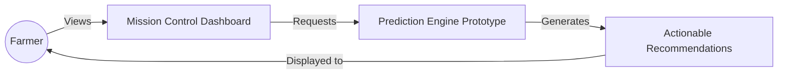
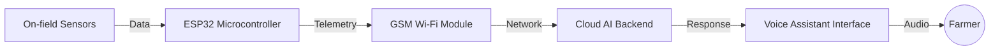

<div align="center">

# 🌿 TerraSense

**Intelligence for Smallholder Farmers**

*From data to actionable farming decisions.*

**Founder & Product Engineer • Prototype • System Architecture**

</div>

---

## 🎯 Product Vision

Smallholder farmers operate on razor-thin margins and often rely on fragmented information, delayed weather updates, and manual decision-making. Extreme weather volatility, pests, and soil degradation reduce yields and income, resulting in massive post-harvest losses.

TerraSense is a scalable, low-cost AgTech product designed to transform environmental data into practical recommendations. By taking the guesswork out of farming, we provide clear, actionable insights when it matters most.

---

## 📊 Market Validation & Competitive Analysis

### The Market Gap
* **$20B+ TAM**: The precision agriculture market is booming, but current solutions target massive commercial farms.
* **The Missing 30%**: Smallholder farmers produce 30% of the world's food but are entirely priced out of existing AgTech solutions. 

### Competitive Positioning

| Feature | Existing Solutions | TerraSense |
| :--- | :--- | :--- |
| **Language** | English only | Local / Vernacular |
| **Connectivity** | High-speed Internet required | Offline-first / GSM Edge Node |
| **Interface** | Complex Mobile/Web UI | Voice Assistant First |
| **Hardware** | $1,000+ proprietary rigs | Subsidized ESP32 IoT Nodes |

---

## 🗺️ The Product Journey

TerraSense creates a closed-loop system for farm management:

**Observe** ➔ **Collect** ➔ **Analyze** ➔ **Recommend** ➔ **Act**

### Core User Story

> **Farmer notices yellowing leaves** ➔ **Opens TerraSense (or uses Voice Assistant)** ➔ **AI cross-references local soil moisture and NPK telemetry** ➔ **TerraSense diagnoses Nitrogen deficiency** ➔ **Generates precise urea application dosage** ➔ **Farmer applies treatment, saving money and preventing over-fertilization.**

---

## 📸 Product Screens (Prototype)

<div align="center">
  
</div>

*Current UI/UX Mockups & Planned Screens:*
- ✅ **Mission Control Dashboard** (Shown above)
- ⏳ **Farmer Home Feed**
- ⏳ **Voice Assistant Interface**
- ⏳ **Multispectral Crop Health Insights**
- ⏳ **Automated Alerts & Weather**

---

## 🚀 Product Roadmap

Investors and stakeholders can track our development milestones here:

| Phase | Milestone | Status |
| :--- | :--- | :--- |
| **v0.1** | Dashboard & UI/UX Prototype Validation | ✅ Complete |
| **v0.2** | Software Intelligence & Voice Assistant NLP | ⏳ In Progress |
| **v0.5** | Hardware Node Prototype Assembly | ⏳ Planned |
| **v1.0** | Pilot Testing (10-20 field nodes) | ⏳ Planned |
| **v2.0** | Commercial Deployment & B2B Integration | ⏳ Planned |

---

## ⚙️ System Architecture

### Current Implementation (Software Prototype)

The current repository houses the v0.1 UI/UX prototype, built using a zero-build CDN-based React setup to allow instant deployment and rapid iteration without complex toolchains.



### Future Vision (Edge-to-Cloud)



---

## 📁 Repository Structure

We have adopted a product-centric repository structure, separating documentation, core prototypes, and static assets.

```text
TerraSense/
├── assets/         # Product screenshots, diagrams, and map textures
├── docs/           # Comprehensive Startup Documentation
│   ├── architecture.md
│   ├── business-model.md
│   ├── market-research.md
│   └── future-roadmap.md
├── prototype/      # React/HTML UI Prototypes
│   ├── index.html  # Product Pitch & Landing Page
│   └── agri.html   # Mission Control Dashboard Simulation
├── README.md       
└── LICENSE         
```

*For an in-depth dive into our business strategy, please explore the `docs/` folder.*

---

## 🛠 Hardware Status

TerraSense is adopting a **Software-First Validation** approach. While currently a digital prototype, the planned hardware edge node will utilize the following stack (implementation planned in v0.5):

| Component | Specification (Planned) |
| :--- | :--- |
| **Microcontroller** | ESP32 DevKit V1 |
| **Sensors** | Capacitive Soil Moisture, DHT22 Temp/Humidity |
| **Power** | 5V Solar Panel + Li-ion Battery |
| **Communication** | GSM Module |

---

## 💻 Installation & Usage

To view the v0.1 React Prototype:

1. **Clone the repository**:
   ```bash
   git clone https://github.com/sohansa035-bot/TerraSense.git
   cd TerraSense/prototype
   ```
2. **View Pitch**: Double-click `index.html`.
3. **View Dashboard**: Double-click `agri.html`.

---

## 📄 License

This project is licensed under the MIT License.
