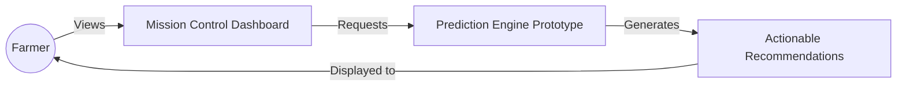
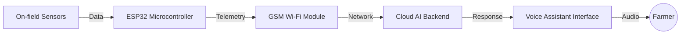

<div align="center">

# 🌿 TerraSense

**Intelligence for Smallholder Farmers**

*From data to actionable farming decisions.*

**Product Designer • Software Prototype • System Architecture**

</div>

---

## 🎯 Product Vision

Smallholder farmers often rely on fragmented information, delayed weather updates, and manual decision-making. Extreme weather volatility, pests, and soil degradation reduce yields and income, resulting in massive post-harvest losses.

TerraSense aims to become an intelligent agricultural assistant that transforms environmental data into practical recommendations. By taking the guesswork out of farming, we provide clear, actionable insights when it matters most.

---

## 📂 Current Repository Scope

This repository focuses on demonstrating the product concept and validating the user experience before committing to hardware development.

**✅ Built (Current Implementation)**
- Product concept & Venture pitch
- React-based UI Prototype
- Mission Control Dashboard
- Product Architecture
- Documentation

**🔮 Future (Planned Vision)**
- ESP32 Hardware Device
- On-field Sensors (Moisture, Temp, Humidity)
- Solar-powered Edge Node
- Voice Assistant Integration
- Field Deployment

---

## 📸 Dashboard Prototype

<div align="center">
  
</div>

---

## ⚙️ System Architecture

### Current Implementation



### Future Vision



---

## ⚖️ Engineering Decisions

### Current
- **React**: For rapid UI prototyping and interactive state management.
- **TailwindCSS**: For reusable, high-fidelity UI components and rapid styling.
- **Dashboard-First Approach**: Validating the user experience and data visualization before investing in hardware production.

### Future
- **ESP32**: For low-power, edge-level data processing.
- **Solar Power**: For completely off-grid, sustainable use in rural areas.
- **Voice Interface**: For ultimate accessibility, bypassing digital literacy and UI barriers entirely.

---

## 📁 Repository Structure

```text
agri/
├── assets/         # Prototype screenshots and assets
├── index.html      # Product Pitch & Landing Page
├── agri.html       # Mission Control Dashboard Simulation
└── README.md       # Project Documentation
```

---

## 🛠 Planned Hardware Architecture

While currently a digital prototype, the planned hardware node will utilize the following stack:

| Component | Specification (Planned) |
| :--- | :--- |
| **Microcontroller** | ESP32 DevKit V1 |
| **Sensors** | Capacitive Soil Moisture, DHT22 Temp/Humidity |
| **Power** | 5V Solar Panel + Li-ion Battery |
| **Communication** | GSM Module |

---

## 🚀 Installation & Usage (Run Locally)

There are no dependencies or build steps required to view the prototype.

1. **Clone the repository**:
   ```bash
   git clone https://github.com/sohansa035-bot/TerraSense.git
   cd TerraSense
   ```
2. **View Pitch**: Double-click `index.html`.
3. **View Dashboard**: Double-click `agri.html`.

---

## 📄 License

This project is licensed under the MIT License.
