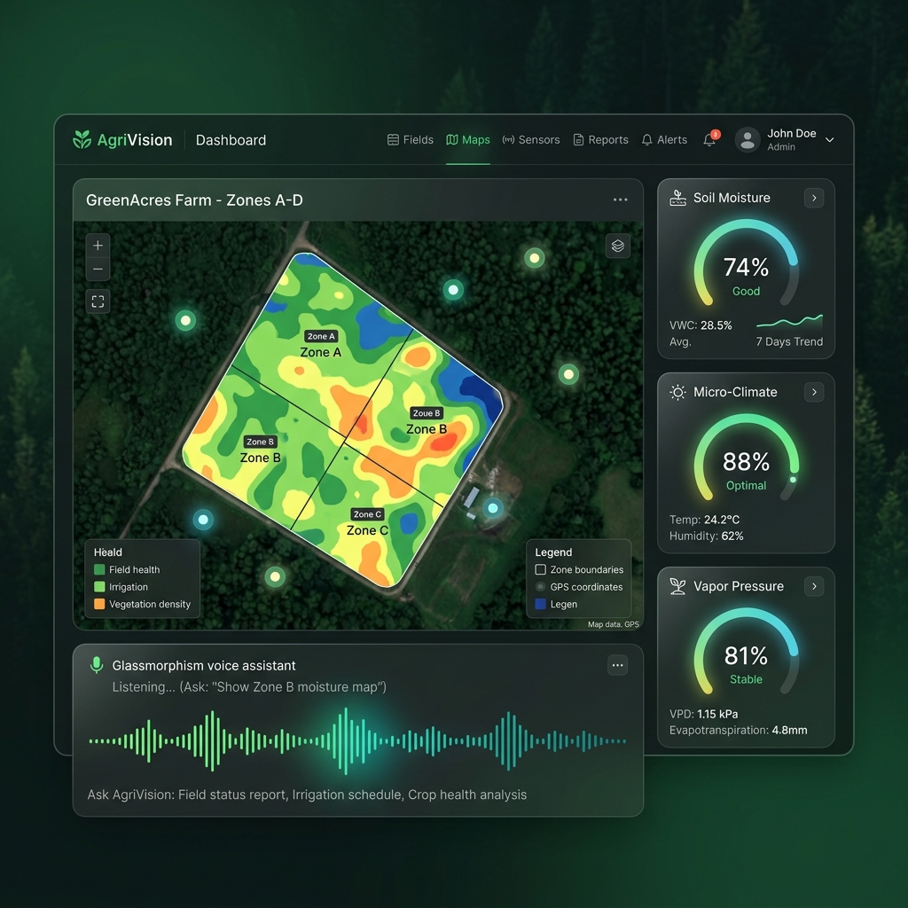
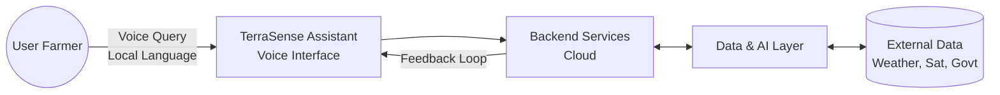

<div align="center">

# 🌿 TerraSense
**Intelligence Without Internet. AI-Powered Agri Assistant for Every Acre.**

[](https://reactjs.org/)
[](https://tailwindcss.com/)
[](https://www.espressif.com/)
[](https://python.org/)
[](https://fastapi.tiangolo.com/)
[](https://openai.com/)

[](https://opensource.org/licenses/MIT)
[]()
[]()

*Made with ❤️ for Indian Farmers*

</div>

---

## 🎯 Product Vision (The Why)

| 👥 Target User | ⚠️ The Problem | ✅ The Solution |
| :--- | :--- | :--- |
| **Smallholder farmers** and **Farmer Producer Organizations (FPOs)** across rural India. | **₹92,000 Cr. annual post-harvest loss** in India due to reliance on intuition rather than hyper-local data.<br><br>Extreme weather volatility, pests, and soil degradation reduce yields and income. | **TerraSense** – a zero-UI, solar-powered voice assistant that delivers hyper-local insights and actionable prescriptions using on-field sensor data and AI.<br><br>Intelligence without internet. Guidance in every voice. |

---

## 📸 Demo & Screenshots

> **Note:** Replace these placeholders with actual images of your hardware and dashboard by placing them in the `assets/` directory.

<div align="center">
  
  
</div>

---

## ✨ What TerraSense Delivers

- 🌱 **Hyper-local Predictions**: Weather, crop yield, pest & disease risk using on-field data + AI models.
- 🗣️ **Voice Assistant**: Ask questions in your language. Get answers as voice.
- 📋 **Actionable Prescriptions**: Clear, simple, and actionable steps tailored to your field.
- 🎛️ **Mission Control**: Visualize trends, alerts, and insights across your farms.
- ⚡ **Low Power + Offline First**: Built for low-connectivity zones. Works when others don't.

---

## ⚙️ Technical Architecture

High-level system architecture of TerraSense.

### Hardware + Edge Flow

```mermaid
graph LR
    subgraph Edge Sensors [ESP32 Node]
        S1[Soil Moisture]
        S2[Temperature]
        S3[Humidity]
        S4[pH/NPK]
    end
    
    GSM[GSM Module <br> SIM800L]
    
    subgraph Cloud Services
        API[FastAPI Backend]
        LLM[AI/ML LLM <br> OpenAI]
        TTS[TTS Engine <br> ElevenLabs]
    end
    
    Voice((Voice Output <br> Local Language))

    Edge Sensors -->|Data JSON| GSM
    GSM <-->|Cellular GPRS| Cloud Services
    API --> LLM
    LLM --> TTS
    Cloud Services -->|Response Audio| GSM
    GSM --> Voice
```

### System Architecture



---

## ⚖️ Engineering Decisions

| Decision | Rationale |
| :--- | :--- |
| 🔋 **Why Edge Computing?** | Ensures low power consumption, faster response, and works in low-connectivity zones. |
| 🎤 **Why Voice (Zero-UI)?** | Overcomes digital literacy barriers. Natural, intuitive, and accessible for all farmers. |
| 📊 **Why Service vs Input Model?** | We provide actionable prescriptions, not just inputs. Focused on outcomes, not sales. |
| 🧩 **Why Open Architecture?** | Modular, open, and extensible. Built to integrate with future sensors and models. |

---

## 📁 Repository Contents (Current State)

This repository contains the digital prototype and supporting modules for TerraSense.

- ✅ **React + TailwindCSS web app** (UI Simulation)
- ✅ **Mission Control Dashboard** (Predictive Analytics)
- ✅ **Voice Assistant Simulation** (Web Speech API + TTS)
- ✅ **Venture Pitch Deck & One-Pager**
- ✅ **Documentation & Architecture**

```text
agri/
├── assets/         # Images, GIFs, diagrams (add your media here)
├── index.html      # Venture Pitch & Landing Page
├── agri.html       # Mission Control Dashboard Simulation
└── README.md       # Project Documentation
```

> [!NOTE]
> The physical hardware (ESP32 device) is in active development and will be open-sourced in a separate repository upon stabilization.

---

## 🚀 Installation & Usage (Run Locally)

Because this prototype is entirely browser-based and uses CDNs, there are **no dependencies or build steps** required.

1. **Clone the repository**
   ```bash
   git clone https://github.com/yourusername/terrasense.git
   cd terrasense
   ```

2. **Open the Landing Page (Pitch)**
   - Double-click `index.html` in your file explorer, or open it in your browser.

3. **Open the Dashboard Simulation**
   - Double-click `agri.html` in your file explorer, or open it in your browser.

---

## 🛠 Hardware & Execution Roadmap

### Bill of Materials (BOM)

| Component | Specification |
| :--- | :--- |
| Microcontroller | ESP32 DevKit V1 |
| Soil Moisture Sensor | Capacitive v1.2 |
| Temp & Humidity Sensor | DHT22 / BME280 |
| pH Sensor | Analog pH Probe |
| GSM Module | SIM800L / SIM7600G |
| Power | 5V Solar Panel + 3000mAh 18650 Battery |
| Enclosure | IP65 Weatherproof Box |

### Roadmap

- [x] **v0.1.0** - Digital Prototype (Current) & Hardware Architecture Finalized
- [ ] **v0.2.0** - Prototype Build & Field Testing
- [ ] **v0.3.0** - AI Model Training on Field Data
- [ ] **v1.0.0** - Pilot Deployment with Farmers (100+ farms)

---

## 🤝 Contributing

We welcome contributions! Please read `CONTRIBUTING.md` before submitting a pull request.

## 📄 License

This project is licensed under the MIT License.
